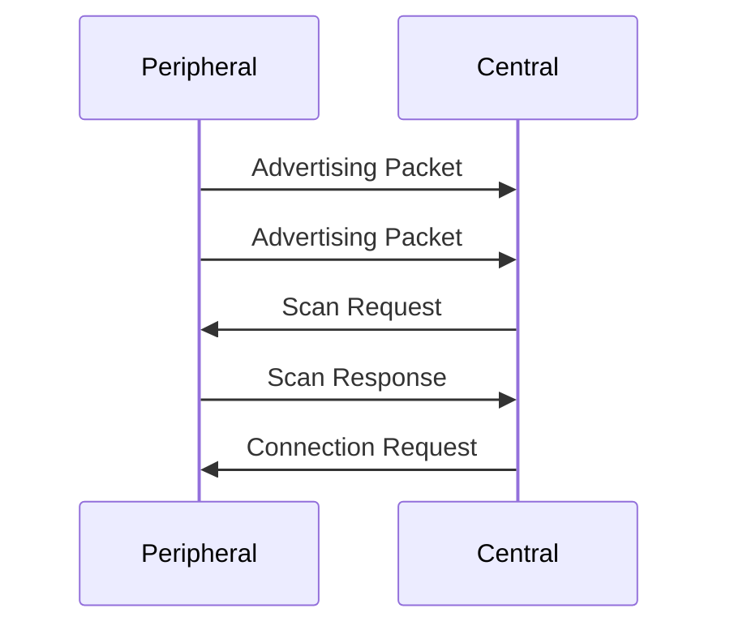

# Vai Trò và Mô Hình Kết Nối trong BLE

## Các Vai Trò Cơ Bản trong BLE

### 1. Central (Thiết Bị Trung Tâm)

#### Đặc điểm chính:

- **Vai trò**: Chủ động quét và kết nối
- **Ví dụ**: Điện thoại, máy tính
- **Chức năng**:
  - Quét tìm thiết bị peripheral
  - Khởi tạo kết nối
  - Quản lý nhiều kết nối

#### Quy trình hoạt động:

1. **Quét (Scanning)**

   - Lắng nghe gói tin quảng bá
   - Phân tích dữ liệu quảng bá
   - Lọc thiết bị theo tiêu chí

2. **Kết nối (Connecting)**

   - Gửi yêu cầu kết nối
   - Thiết lập tham số kết nối
   - Đàm phán bảo mật

3. **Quản lý kết nối**
   - Duy trì nhiều kết nối
   - Điều chỉnh tham số kết nối
   - Xử lý ngắt kết nối

### 2. Peripheral (Thiết Bị Ngoại Vi)

#### Đặc điểm chính:

- **Vai trò**: Quảng bá và chờ kết nối
- **Ví dụ**: Cảm biến, thiết bị IoT
- **Chức năng**:
  - Phát gói tin quảng bá
  - Phản hồi yêu cầu quét
  - Chấp nhận kết nối

#### Quy trình hoạt động:

1. **Quảng bá (Advertising)**

   ```
   Advertising Data:
   - Tên thiết bị
   - UUID của services
   - Dữ liệu tùy chỉnh
   - Cường độ phát
   ```

2. **Phản hồi quét (Scan Response)**

   - Cung cấp thông tin bổ sung
   - Tối đa 31 bytes dữ liệu
   - Tùy chọn (không bắt buộc)

3. **Xử lý kết nối**
   - Chấp nhận yêu cầu kết nối
   - Thiết lập tham số kết nối
   - Cung cấp dịch vụ

## Quy Trình Kết Nối Chi Tiết

### 1. Giai Đoạn Quảng Bá và Quét



### 2. Thiết Lập Kết Nối

#### Tham số kết nối:

- **Connection Interval**

  - Thời gian giữa các sự kiện kết nối
  - Phạm vi: 7.5ms đến 4s
  - Ảnh hưởng đến độ trễ và năng lượng

- **Slave Latency**

  - Số sự kiện kết nối có thể bỏ qua
  - Tối ưu năng lượng cho peripheral
  - Giá trị thường: 0-30

- **Connection Supervision Timeout**
  - Thời gian tối đa không có gói tin
  - Phát hiện mất kết nối
  - Thường là 4-6 giây

### 3. Duy Trì Kết Nối

#### Cơ chế duy trì:

1. **Connection Events**

   - Trao đổi gói tin theo chu kỳ
   - Đồng bộ thời gian
   - Kiểm tra lỗi và tái truyền

2. **Power Management**

   - Chế độ ngủ giữa các sự kiện
   - Tự động điều chỉnh công suất
   - Tối ưu hóa năng lượng

3. **Link Layer Control**
   - Cập nhật tham số kết nối
   - Mã hóa và bảo mật
   - Xử lý lỗi kết nối

## Các Kịch Bản Kết Nối Phổ Biến

### 1. Kết Nối Đơn Giản

```
Central → Quét → Tìm thiết bị → Kết nối → Trao đổi dữ liệu
```

### 2. Kết Nối Bảo Mật

```
Central → Quét → Kết nối → Ghép nối → Mã hóa → Trao đổi dữ liệu
```

### 3. Kết Nối Nhiều Thiết Bị

```
Central → Quét → Kết nối thiết bị 1
      → Quét → Kết nối thiết bị 2
      → Quản lý đồng thời nhiều kết nối
```

## Xử Lý Lỗi và Khôi Phục

### 1. Các Loại Lỗi Thường Gặp

- Mất kết nối
- Nhiễu tín hiệu
- Lỗi gói tin
- Timeout

### 2. Chiến Lược Khôi Phục

- Tự động kết nối lại
- Điều chỉnh tham số
- Thử lại với tham số khác
- Thông báo cho ứng dụng

## Tối Ưu Hóa Kết Nối

### 1. Tiết Kiệm Năng Lượng

- Điều chỉnh chu kỳ quảng bá
- Tối ưu connection interval
- Sử dụng slave latency
- Điều chỉnh công suất phát

### 2. Cải Thiện Hiệu Suất

- Tối ưu kích thước gói tin
- Giảm độ trễ kết nối
- Cân bằng năng lượng và tốc độ
- Xử lý đa kết nối hiệu quả

## Tổng Kết

- Vai trò Central và Peripheral có chức năng riêng biệt
- Quy trình kết nối phức tạp nhưng có tổ chức
- Cần cân nhắc nhiều yếu tố khi thiết kế kết nối
- Tối ưu hóa quan trọng cho hiệu suất và năng lượng

## Tài Liệu Tham Khảo

1. [Bluetooth Core Specification](https://www.bluetooth.com/specifications/specs/)
2. [BLE Connection Parameters](https://devzone.nordicsemi.com/nordic/short-range-guides/b/bluetooth-low-energy/posts/ble-connection-parameters-explained)
3. [Understanding BLE Connections](https://learn.adafruit.com/introduction-to-bluetooth-low-energy/gap)
