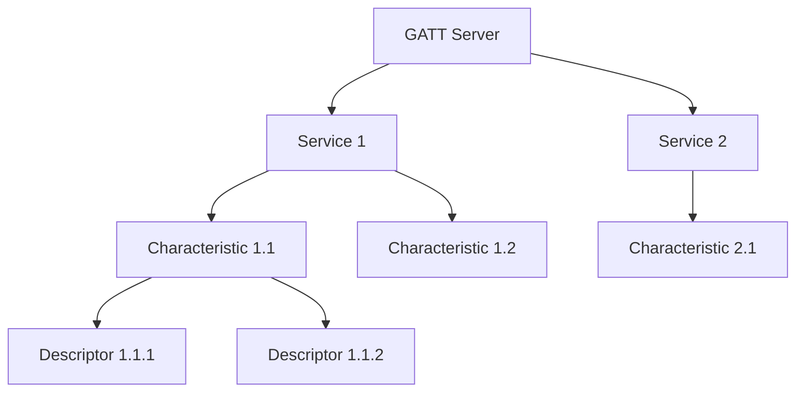
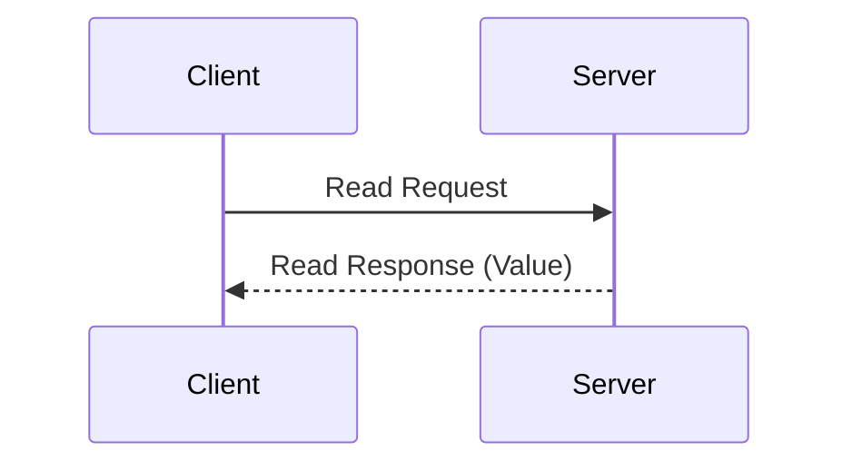
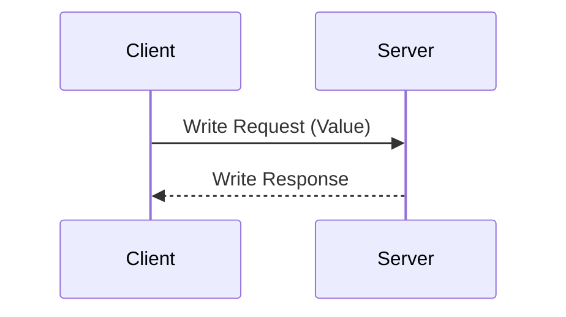
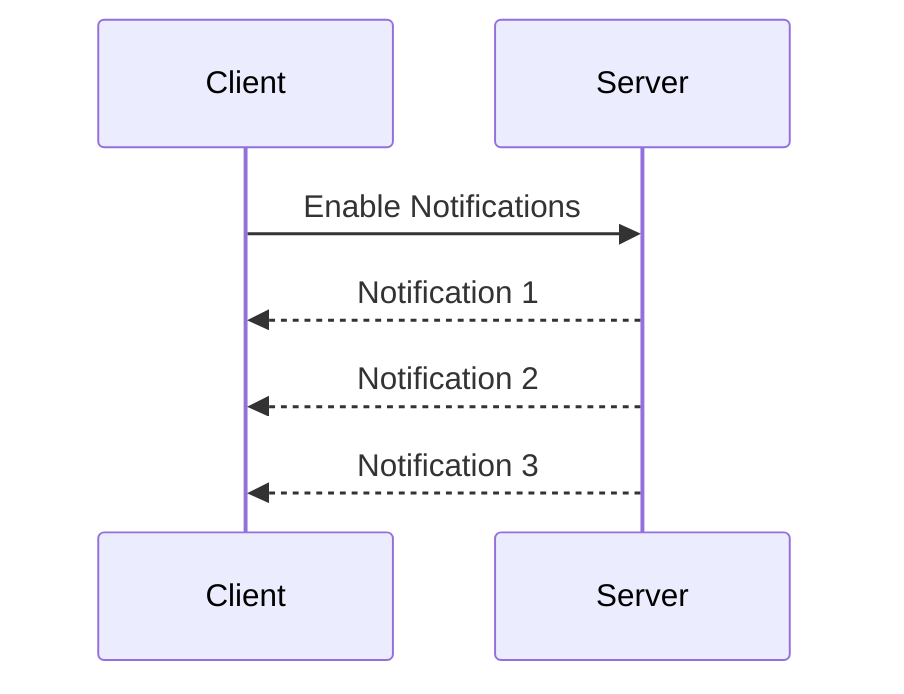

# GATT Services và Characteristics trong BLE

## GATT (Generic Attribute Profile)

### Tổng Quan về GATT

- **Định nghĩa**: Giao thức xác định cách truyền và nhận dữ liệu trong BLE
- **Vai trò**:
  - Định nghĩa cấu trúc dữ liệu
  - Quy định cách tương tác
  - Tổ chức và quản lý dữ liệu

### Mô Hình Client-Server



## GATT Services

### 1. Khái Niệm Service

- **Định nghĩa**: Container chứa các characteristics liên quan
- **Phân loại**:
  - Primary Service: Dịch vụ chính
  - Secondary Service: Dịch vụ phụ trợ
- **Định danh**: UUID (16-bit hoặc 128-bit)

### 2. Các Service Tiêu Chuẩn

| Service            | UUID   | Mô tả                       |
| ------------------ | ------ | --------------------------- |
| Generic Access     | 0x1800 | Thông tin cơ bản thiết bị   |
| Generic Attribute  | 0x1801 | Quản lý GATT                |
| Device Information | 0x180A | Thông tin chi tiết thiết bị |
| Battery Service    | 0x180F | Thông tin pin               |
| Heart Rate         | 0x180D | Dữ liệu nhịp tim            |

### 3. Custom Services

```python
# Ví dụ định nghĩa Custom Service
CUSTOM_SERVICE_UUID = "12345678-1234-5678-1234-56789abcdef0"
class MyCustomService:
    def __init__(self):
        self.characteristics = []
        self.uuid = CUSTOM_SERVICE_UUID
```

## GATT Characteristics

### 1. Cấu Trúc Characteristic

```
Characteristic = {
    UUID,
    Value,
    Properties,
    Permissions,
    Descriptors
}
```

### 2. Properties (Thuộc Tính)

| Thuộc tính             | Mô tả                    | Bit  |
| ---------------------- | ------------------------ | ---- |
| Broadcast              | Cho phép quảng bá        | 0x01 |
| Read                   | Cho phép đọc             | 0x02 |
| Write Without Response | Ghi không phản hồi       | 0x04 |
| Write                  | Ghi có phản hồi          | 0x08 |
| Notify                 | Thông báo không xác nhận | 0x10 |
| Indicate               | Thông báo có xác nhận    | 0x20 |

### 3. Permissions (Quyền)

- **Read Permissions**
  - Open
  - Encrypted
  - Authorized
- **Write Permissions**
  - Open
  - Encrypted
  - Authorized

### 4. Các Loại Characteristic Phổ Biến

#### Device Name Characteristic

```python
# UUID: 0x2A00
class DeviceNameCharacteristic:
    properties = ['read', 'write']
    value = "My BLE Device"
```

#### Battery Level Characteristic

```python
# UUID: 0x2A19
class BatteryLevelCharacteristic:
    properties = ['read', 'notify']
    value = 100  # Phần trăm
```

## Descriptors (Bộ Mô Tả)

### 1. Vai Trò của Descriptor

- Cung cấp metadata cho characteristic
- Định nghĩa định dạng dữ liệu
- Cấu hình thông báo

### 2. Các Loại Descriptor Phổ Biến

| Descriptor                          | UUID   | Mục đích                 |
| ----------------------------------- | ------ | ------------------------ |
| Client Characteristic Configuration | 0x2902 | Cấu hình notify/indicate |
| Characteristic User Description     | 0x2901 | Mô tả người dùng         |
| Characteristic Format               | 0x2904 | Định dạng dữ liệu        |

## Tương Tác với GATT

### 1. Quy Trình Đọc Dữ Liệu



### 2. Quy Trình Ghi Dữ Liệu



### 3. Cơ Chế Thông Báo



## Ví Dụ Thực Tế

### 1. Service Cảm Biến Nhiệt Độ

```python
TEMPERATURE_SERVICE_UUID = "0000181A-0000-1000-8000-00805F9B34FB"

class TemperatureService:
    def __init__(self):
        self.temperature_char = TemperatureCharacteristic()
        self.battery_char = BatteryCharacteristic()
```

### 2. Characteristic Nhiệt Độ

```python
TEMPERATURE_CHAR_UUID = "00002A1C-0000-1000-8000-00805F9B34FB"

class TemperatureCharacteristic:
    properties = ['read', 'notify']

    def __init__(self):
        self.value = 25.0  # Celsius

    def update_value(self, new_temp):
        self.value = new_temp
        # Trigger notification
```

## Các Kỹ Thuật Tối Ưu

### 1. Tối Ưu Kích Thước Dữ Liệu

- Nén dữ liệu khi cần thiết
- Sử dụng định dạng nhị phân
- Tránh dữ liệu dư thừa

### 2. Tối Ưu Thông Báo

- Điều chỉnh tần suất thông báo
- Gộp dữ liệu khi có thể
- Sử dụng ngưỡng thay đổi

### 3. Xử Lý Lỗi

- Kiểm tra tính hợp lệ của dữ liệu
- Xử lý timeout
- Retry mechanism

## Tổng Kết

- GATT là nền tảng cho truyền dữ liệu BLE
- Services và Characteristics tổ chức dữ liệu có cấu trúc
- Descriptors cung cấp metadata quan trọng
- Tối ưu hóa quan trọng cho hiệu suất

## Tài Liệu Tham Khảo

1. [Bluetooth GATT Specification](https://www.bluetooth.com/specifications/gatt/)
2. [GATT Services Library](https://www.bluetooth.com/specifications/gatt/services/)
3. [BLE Data Transfer Guide](https://learn.adafruit.com/introduction-to-bluetooth-low-energy/gatt)
